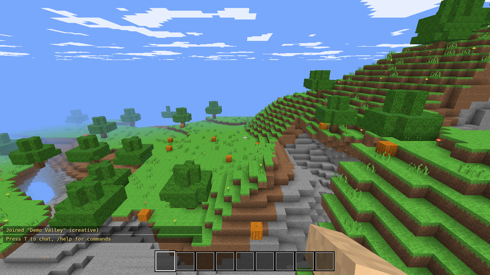
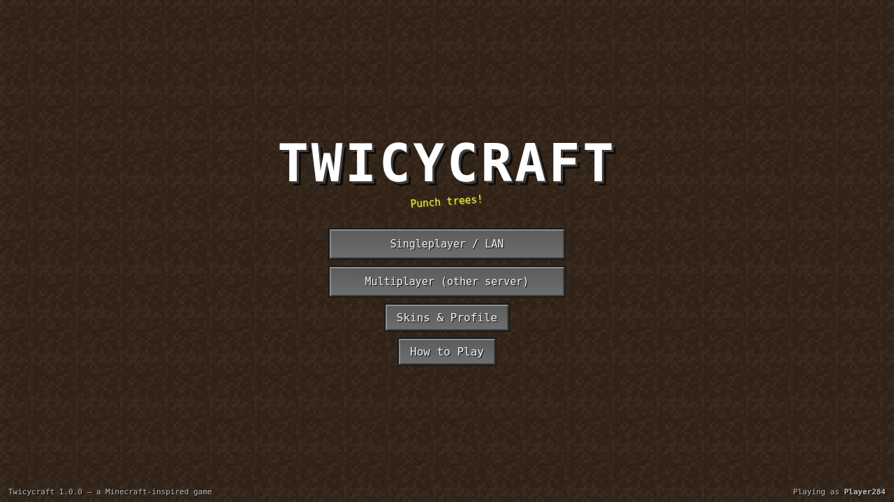
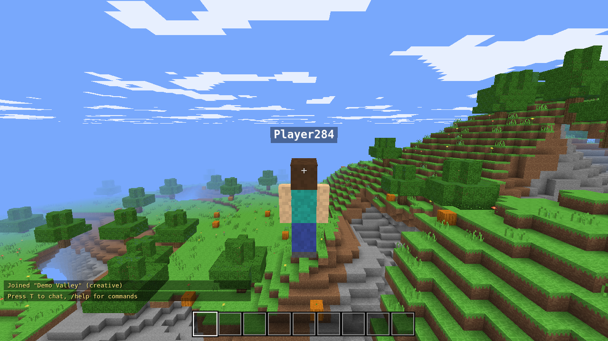
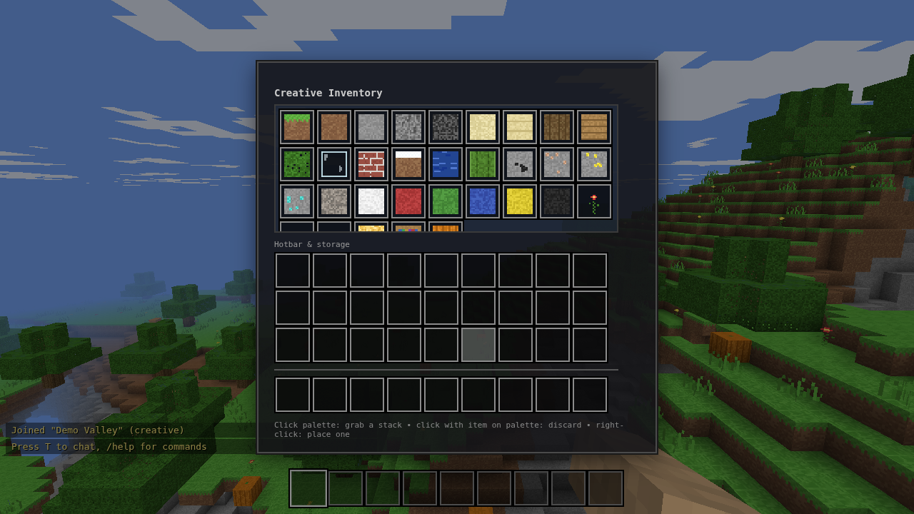

# Twicycraft

A Minecraft-inspired voxel game built completely from scratch — no game engine,
no frameworks, **zero runtime dependencies**. The client is a hand-written
WebGL2 voxel engine; the server is plain Node.js with a from-scratch
WebSocket implementation.



## Features

- **Survival mode** — health, fall damage, drowning (air bubbles), progressive
  block breaking with crack animations, mined blocks drop into your inventory,
  slow regeneration, death & respawn screen
- **Creative mode** — flight (double-tap Space), instant breaking, unlimited
  blocks from the creative palette
- **Inventory system** — 9-slot hotbar + 27 storage slots, drag & drop,
  right-click splitting, shift-click quick move, 64-stack limit, middle-click
  block picking
- **Block placement & breaking** — raycast targeting with selection outline,
  per-block hardness, 32 block types (ores, wood, glass, wool colors, flowers…)
- **Procedural world generation** — seeded & deterministic: biomes (plains,
  forest, desert, snowy, mountains, ocean), caves, ore veins by depth, trees,
  cacti, lakes & beaches, bedrock floor
- **Character skins** — 8 procedurally painted skins with a live preview picker
- **Multiplayer** — shared worlds over WebSockets: see other players move,
  swing, and build in real time; chat with commands (`/gamemode`, `/time`,
  `/players`); player list on Tab
- **Minecraft-style animations** — walking arm/leg swing, punch/swing arm,
  first-person arm & held block with view bobbing, crack overlay stages,
  day/night cycle with sun, moon, stars and drifting clouds, third-person view (F5)
- **Main menu** — world list with create/delete, Survival/Creative selection,
  seed input, skin & profile editor, controls help
- **Save / load worlds** — the server persists every world (terrain edits, time
  of day, and per-player position/inventory/health/gamemode) to `worlds/*.json`;
  in offline mode the same data is saved to your browser's localStorage —
  either way you rejoin exactly where you stopped

| | | |
|---|---|---|
|  |  |  |

## Play it

**▶ Play in your browser (no install): https://toer15.github.io/twicy/**

That static version runs in *offline mode*: full singleplayer with worlds
saved in your browser (localStorage). Deployed automatically by the GitHub
Pages workflow in `.github/workflows/pages.yml`.

### Run the full version (with multiplayer)

Requires Node.js ≥ 18. No `npm install` needed.

```bash
npm start          # or: node server/server.js
```

Then open **http://localhost:3000**, create a world, play. The game
automatically detects whether a server is reachable — with one it uses
server-side worlds and multiplayer; without one it falls back to offline
mode (you can even open `public/index.html` straight from disk).

### Multiplayer

Everyone who opens your server's URL shares the same world list — friends on
your network just open `http://<your-ip>:3000` (printed on server startup) and
press Play on the same world. You can also connect to a different server from
the title screen via *Multiplayer (other server)*.

## Controls

| Key | Action |
|---|---|
| W A S D / mouse | Move / look |
| Space | Jump / swim up / fly up |
| Double Space | Toggle flying (creative) |
| Shift / Ctrl | Sneak / sprint (or double-tap W) |
| Left / right / middle click | Break / place / pick block |
| 1–9, mouse wheel | Select hotbar slot |
| E | Inventory |
| T or / | Chat & commands |
| Tab / F3 / F5 | Player list / debug info / third person |
| Esc | Pause, settings |

## How it works

```
public/            the entire game client (plain JS, classic scripts)
  js/noise.js        seeded perlin noise + fBM
  js/worldgen.js     biomes, caves, ores, trees — deterministic per seed
  js/mesher.js       chunk → triangles, with per-vertex ambient occlusion
  js/renderer.js     WebGL2: one shader for chunks, entities, sky, overlays
  js/textures.js     the whole texture atlas is painted in code (no assets)
  js/skins.js        skin painter + shared player-model UV layout
  js/entities.js     remote players: interpolation + walk/swing animation
  js/player.js       AABB physics: walking, swimming, flying, fall damage
  js/main.js         game loop, chunk streaming, block interaction, net sync
server/
  ws.js              RFC 6455 WebSocket server written from scratch
  server.js          static files + world rooms + JSON persistence
```

Because generation is deterministic, the server never generates terrain — it
stores only the *edits* (a sparse `"x,y,z" → block` map) plus player data, and
every client regenerates identical terrain from the seed.

## Tests

```bash
npm test           # headless logic tests + full server/protocol integration test
```

`test/smoke.js` runs the actual client code (worldgen, meshing, physics,
inventory) in a Node VM; `test/server.test.js` boots the real server and plays
a two-client multiplayer session over real WebSockets. There's also an
optional visual test that drives the game in headless Chrome and captures the
screenshots above: `npm i --no-save puppeteer && node test/visual.test.js`.
